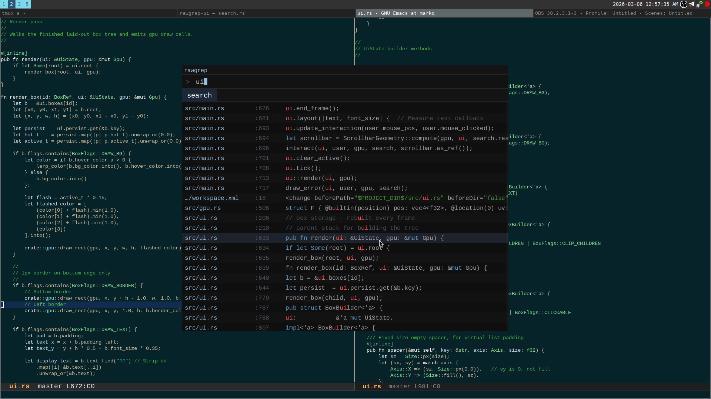

# rawgrep-ui

A fast, minimal search interface for [rawgrep](https://github.com/rakivo/rawgrep) - The fastest grep in the world.




### Prerequisites

- Linux (contribute to make rawgrep support Windows) system with ext4/ntfs filesystem
- Rust toolchain (for building from source)
- Root access or be able to set capabilities


## Installation - same as rawgrep

### Option 1: One-Time Setup with Capabilities (Recommended)

```bash
git clone https://github.com/rakivo/rawgrep
cd rawgrep

cargo build --profile=release-fast

# If you want maximum speed possible (requires nightly):
# cargo +nightly build --profile=release-fast --target=<your_target> --features=use_nightly

# Run the one-time setup command. Why? Read "Why Elevated Permissions?" section
sudo setcap cap_dac_read_search=eip ./target/release-fast/rawgrep
```

Now you can run it without `sudo`:
```bash
rawgrep "search pattern"
```

### Option 2: Use `sudo` Every Time

If you prefer not to use capabilities, just build and run with `sudo`:

```bash
cargo build --profile=release-fast

# Again, if you want maximum speed possible (requires nightly):
# cargo +nightly build --profile=release-fast --target=<your_target> --features=use_nightly

# Run with sudo each time
sudo ./target/release-fast/rawgrep "search pattern"
```


## Usage

```bash
rawgrep-ui
```

Type a pattern and press RET or click Search. Results stream in as they're found, but you wouldn't notice this anyway, since rawgrep is insanely fast, of course given that you're not using a 100 year old HDD. Click a result to open it in Emacs.


## Keybindings

| Key | Action |
|-----|--------|
| RET | Search |
| Escape | Quit |
| Ctrl+Scroll | Zoom in/out |
| C-a / C-e | Start / end of line |
| C-b / C-f | Move cursor left / right |
| C-k | Kill line |
| M-d / C-w | Kill word forward / back |
| M-f / M-b | Move word forward / back |


## Why Elevated Permissions?

`rawgrep` reads raw block devices (e.g., `/dev/sda1`), which are protected by the OS. Instead of requiring full root access via `sudo` every time, we use Linux capabilities to grant **only** the specific permission needed.

### What is `CAP_DAC_READ_SEARCH`?

This capability grants exactly **one** permission: bypass file read permission checks.

**`rawgrep` only reads data, it never writes anything to disk.**

### Verifying Capabilities

You can verify what capabilities the binary has:

```bash
getcap ./target/release-fast/rawgrep
# Output: ./target/release-fast/rawgrep = cap_dac_read_search+eip
```

### Removing Capabilities

If you want to revoke the capability and go back to using `sudo`:

```bash
sudo setcap -r ./target/release-fast/rawgrep
```

## Limitations (IMPORTANT)

- **ext4/ntfs only:** Currently only supports ext4/ntfs filesystems.

## Development

**Note:** Capabilities are tied to the binary file itself, so you'll need to re-run `setcap` after each rebuild.

> **Why no automation script?** I intentionally decide not to provide a script that runs `sudo` commands. If you want automation, write your own script, it's just a few lines of bash code and you'll understand exactly what it does.


## Contributing

Contributions are welcome! Please feel free to submit a Pull Request.

## Roadmap

- [ ] Support for Windows. (Some physical partition stuff needs to get fixed on Windows, besides that everything should be already working)
- [ ] Symlink support

## Font

Uses [Liberation Mono](https://github.com/liberationfonts/liberation-fonts) - see `fonts/OFL.txt` for license.

## License

MIT
